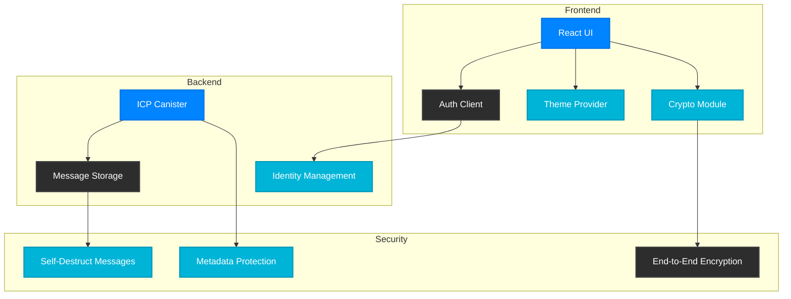
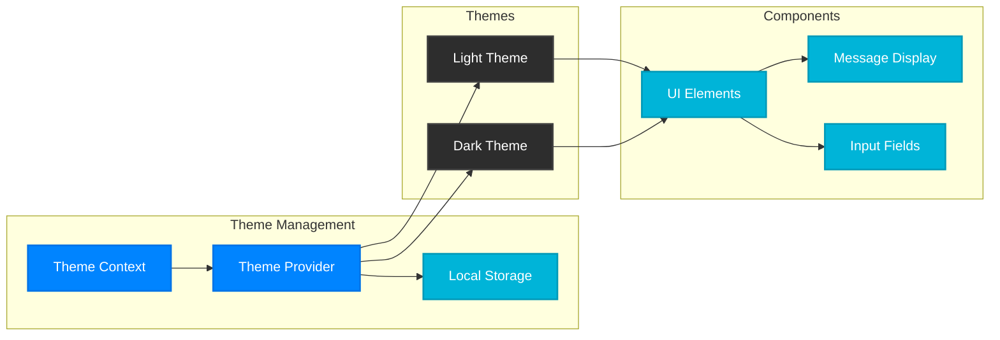
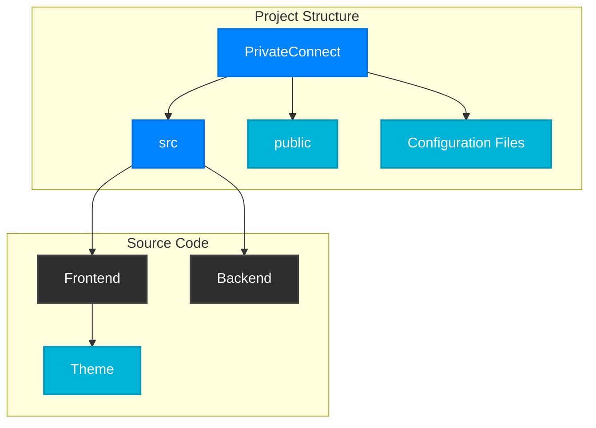

# 🔒 PrivateConnect

A privacy-focused decentralized messaging platform built on Internet Computer Protocol (ICP) and Calimero Network.

## 🏗️ Architecture




## 🎨 Theme System



## ✨ Features

- 🔒 End-to-end encrypted messaging
- 🕒 Self-destructing messages
- 🎭 Private metadata handling
- 🌓 Dark/Light theme support
- 🔑 Internet Identity authentication
- 📱 Responsive design

## 🛠️ Technology Stack

- **Frontend**:
  - React.js
  - Styled Components
  - TweetNaCl.js (Encryption)
  - Internet Identity SDK

- **Backend**:
  - Internet Computer Protocol (ICP)
  - Motoko
  - Calimero Network SDK

## 🚀 Getting Started

### Prerequisites

```bash
# Install the DFINITY Canister SDK
sh -ci "$(curl -fsSL https://internetcomputer.org/install.sh)"

# Install project dependencies
npm install
```

### Development

```bash
# Start the local ICP network
dfx start --background

# Deploy the canisters
dfx deploy

# Start the development server
npm start
```

## 💻 Project Structure



## 🔐 Security Features

1. **End-to-End Encryption**:
   - TweetNaCl.js for encryption
   - Secure key exchange
   - Zero-knowledge message content

2. **Metadata Protection**:
   - Calimero Network integration
   - Protected user identities
   - Encrypted timestamps

3. **Self-Destructing Messages**:
   - Time-based message expiry
   - Secure message deletion
   - No message persistence

## 🎨 UI/UX Features

1. **Theme Support**:
   - Dark/Light mode toggle
   - System theme detection
   - Persistent theme preference
   - Smooth theme transitions

2. **Responsive Design**:
   - Mobile-first approach
   - Fluid layouts
   - Optimized for all devices

3. **Modern Interface**:
   - Gradient accents
   - Card-based design
   - Interactive elements
   - Visual feedback

## 🤝 Contributing

1. Fork the repository
2. Create your feature branch (`git checkout -b feature/AmazingFeature`)
3. Commit your changes (`git commit -m 'Add some AmazingFeature'`)
4. Push to the branch (`git push origin feature/AmazingFeature`)
5. Open a Pull Request

## 📄 License

This project is licensed under the MIT License - see the [LICENSE](LICENSE) file for details.

## 🙏 Acknowledgments

- ICP Hub Bulgaria
- Calimero Network Team
- DFINITY Foundation
